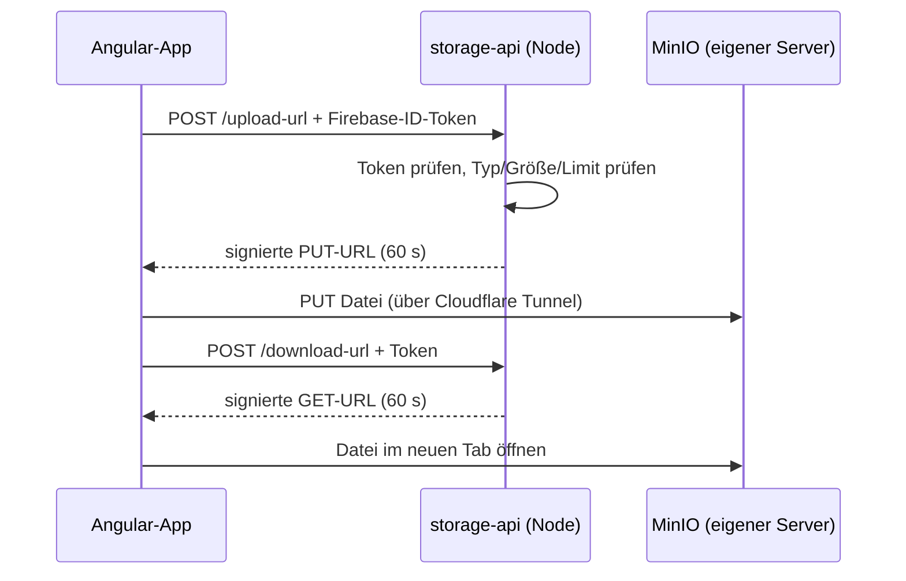

# DABubble

Ein Team-Messenger nach dem Vorbild von Slack: Channels, Direktnachrichten und Threads in Echtzeit.
Entstanden als Abschlussprojekt der Weiterbildung zum Frontend-Entwickler bei der
[Developer Akademie](https://developerakademie.com/), umgesetzt nach deren Figma-Design.

**Live:** [dabubble.dimit.cc](https://dabubble.dimit.cc) (Gast-Login ohne Registrierung möglich)

## Funktionen

**Konto**
- Registrierung mit E-Mail und Passwort (inkl. Avatar-Auswahl), Login mit Google oder als Gast
- Passwort vergessen / zurücksetzen per E-Mail
- Profil ansehen und bearbeiten (Name, Avatar)
- Eigener Status: Aktiv, Abwesend, Nicht stören oder Offline

**Chatten**
- Channels anlegen (ohne doppelte Namen), Mitglieder per Suche hinzufügen, entfernen (Ersteller)
  oder selbst austreten
- Direktnachrichten, auch an sich selbst, und Threads zu jeder Nachricht
- Nachrichten bearbeiten und löschen, Hinweis „(bearbeitet)“
- Datei-Anhänge (Bilder, PDF, Office, Text) auf eigenem Server
- Reaktionen mit Emojis: die zwei zuletzt genutzten direkt in der Hover-Leiste, ab sieben
  Reaktionen „+X weitere“, Tooltip „Anna und Du haben mit 🚀 reagiert“
- `@Person` und `#Channel` im Eingabefeld mit Vorschlagsliste; in der Nachricht anklickbar
- Einfache Formatierung: `*fett*`, `_kursiv_`, `` `Code` ``; Links werden anklickbar
- Neue Nachricht an `#Channel`, `@Person` oder E-Mail-Adresse

**Überblick behalten**
- Suche über Channels, Personen und Nachrichten (`#` / `@` filtern, Strg+K), Sprung zum Treffer
- Ungelesen-Punkte in der Sidebar und an Threads, Anzahl im Browser-Tab, Trennlinie „Neue Nachrichten“
- „Anna schreibt gerade …“ und Online-Status in Echtzeit, auch beim Schließen des Tabs
- Automatisches Scrollen zur neuesten Nachricht, ohne beim Lesen älterer Nachrichten wegzuspringen

## Technik

| Bereich | Einsatz |
|---|---|
| Frontend | Angular 21 (Standalone Components, Signals, zoneless), TypeScript (strict), SCSS |
| Anmeldung | Firebase Authentication (E-Mail/Passwort, Google, anonym für Gäste) |
| Daten | Cloud Firestore (User, Channels, Nachrichten, Threads, Gelesen-Stand) |
| Echtzeit-Präsenz | Firebase Realtime Database (Verbindungsstatus mit `onDisconnect`, „schreibt gerade“) |
| Datei-Anhänge | MinIO (S3-kompatibel) auf eigenem Server, Node/Express-Gateway (`storage-api/`) |
| Sicherheit | Firestore- und Realtime-Database-Rules, mit Tests gegen die Emulatoren |

Die Zugriffslogik liegt in den Rules (`firestore.rules`, `database.rules.json`), nicht nur in der
Oberfläche: Gäste sehen nur freigegebene Channels und Demo-User, Direktnachrichten nur die
Beteiligten, bearbeiten und löschen darf nur der Absender, andere aus einem Channel entfernen nur
der Ersteller. Der Online-Status kommt ohne Cloud Functions aus und läuft im kostenlosen
Firebase-Tarif.

### Architektur der Datei-Anhänge



- **Keine S3-Schlüssel im Frontend:** Nur das Gateway kennt die Zugangsdaten und stellt
  kurzlebige, signierte URLs aus. Die Dateien selbst gehen direkt zwischen Browser und MinIO.
- **Nur registrierte Nutzer laden hoch** (Gäste = anonymer Login werden abgelehnt), mit
  Größen-, Typ- und Mengenbegrenzung.
- **Links gelten 60 Sekunden.** Der Bucket ist privat; der Schlüssel jeder Datei enthält eine
  zufällige UUID und steht nur in Nachrichten, die Firestore per Rules schützt.
- MinIO und Gateway sind über einen Cloudflare Tunnel erreichbar, ohne offene Ports am Server.

Details zu API und Deploy: [storage-api/README.md](storage-api/README.md)

## Lokal starten

Voraussetzungen: Node.js 22 oder neuer, Java 11 oder neuer (für die Firebase-Emulatoren).

```bash
npm install
```

### Mit den Firebase-Emulatoren (empfohlen, ohne echte Daten)

```bash
npm run emulators        # Auth, Firestore und Realtime Database lokal (Projekt demo-dabubble)
npm run seed:emulator    # Demo-User, Channels und Nachrichten anlegen (zweites Terminal)
npm run start:emulator   # App unter http://localhost:4200 gegen die Emulatoren
```

Der Gäste-Login funktioniert sofort, der Google-Login über ein simuliertes Konto-Fenster.
Datei-Anhänge sind im Emulator deaktiviert (der Button ist ausgegraut), weil das Gateway nur
echte Firebase-Tokens prüft.

### Mit einem eigenen Firebase-Projekt

1. `src/environments/environment.example.ts` nach `src/environments/environment.ts` kopieren
   und die Web-Konfiguration des Projekts eintragen (inkl. `databaseURL` der Realtime Database).
   Für Anhänge `storageApiUrl` auf die Adresse des eigenen Gateways setzen, sonst leer lassen.
2. Rules deployen: `npx firebase-tools deploy --only "firestore:rules,database"`
3. `npm start`

`environment.ts` ist per `.gitignore` ausgeschlossen.

## Tests

```bash
npm test                 # Angular-Unit-Tests (Vitest)
npm run test:rules       # Firestore- und Realtime-Database-Rules gegen die Emulatoren
npm run test:rules:live  # Smoke-Test gegen das echte Projekt (Wegwerf-Accounts, räumt auf)
cd storage-api && npm test   # Routen des Datei-Gateways (ohne Firebase und MinIO)
```

## Build

```bash
npm run build            # Ausgabe in dist/DABubble/browser
```

Für Apache-Hosting liegt eine `.htaccess` bei, damit Angular-Routen auch beim Neuladen funktionieren.

## Projektstruktur

```
src/app
├── components/     Seiten und Bausteine (auth, workspace, channel, profile, overlay …)
├── pages/          Impressum und Datenschutz
└── shared/         Services und gemeinsame Komponenten (Firebase, Nachrichten, Suche,
                    Präsenz, Ungelesen-Stand, Erwähnungen, Reaktionen, Icons …)
src/styles          Globale SCSS-Partials (Farben, Mixins, Typografie)
firestore-tests/    Rules-Tests, Live-Smoke-Test, Emulator-Seed
storage-api/        Gateway für Datei-Anhänge (Node, Docker)
```

## Autor

Milos Dimitrijevic
