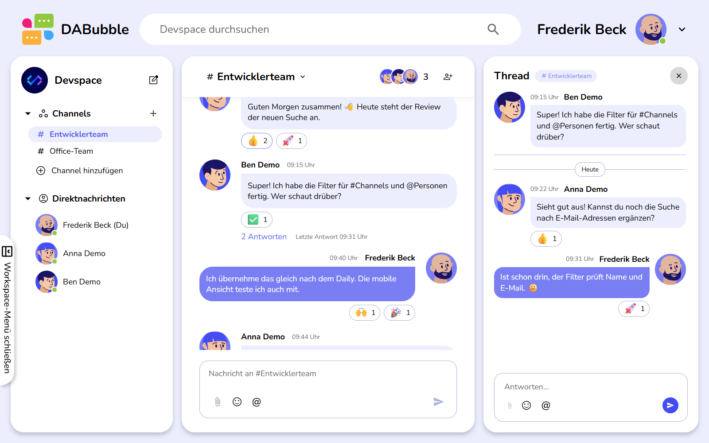
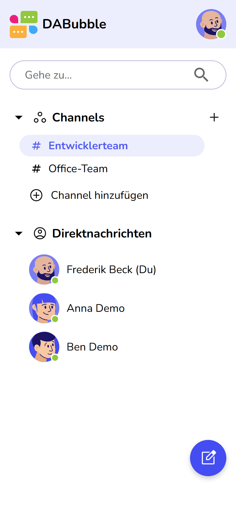
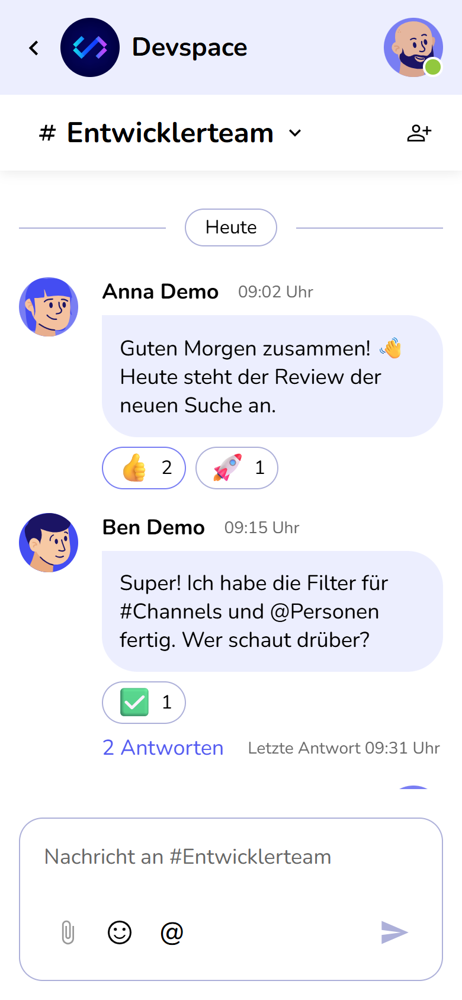
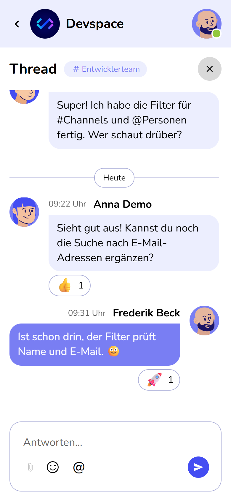
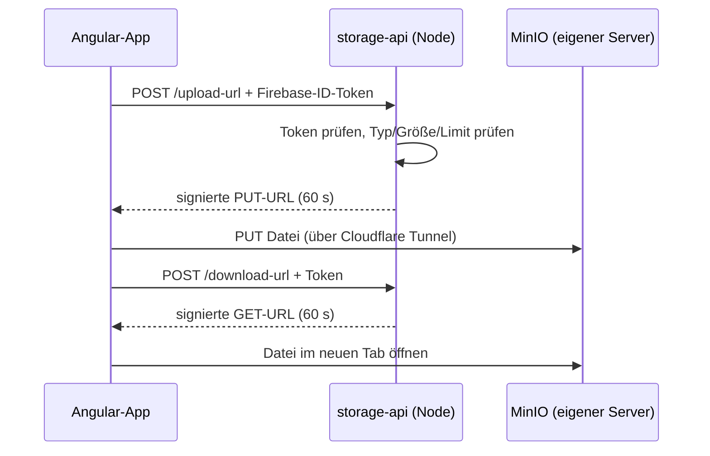

<div align="center">


### Ein Team-Messenger nach dem Vorbild von Slack – Channels, Direktnachrichten und Threads in Echtzeit

[](https://dabubble.dimit.cc)


[Funktionen](#-funktionen) · [Mobil](#-mobil) · [Technik](#%EF%B8%8F-technik) · [Sicherheit](#-sicherheit) · [Lokal starten](#-lokal-starten) · [Tests](#-tests)

<br>



</div>

<br>

> Abschlussprojekt der Weiterbildung zum Frontend-Entwickler bei der
> [Developer Akademie](https://developerakademie.com/), umgesetzt nach deren Figma-Design –
> vom Login bis zur mobilen Ansicht. **Zum Ausprobieren:** auf der Live-Seite einfach
> „Gäste-Login“ wählen, eine Registrierung ist nicht nötig.

---

## ✨ Funktionen

<table>
<tr>
<td width="50%" valign="top">

### 👤 Konto
- Registrierung mit E-Mail und Passwort, Avatar-Auswahl
- Login mit **Google** oder als **Gast**
- Passwort vergessen / zurücksetzen per E-Mail
- Profil bearbeiten (Name, Avatar)
- Eigener Status: 🟢 Aktiv · 🟡 Abwesend · 🔴 Nicht stören · ⚫ Offline

### 💬 Chatten
- **Channels** anlegen (ohne doppelte Namen), Mitglieder hinzufügen, entfernen oder austreten
- **Direktnachrichten** – auch an sich selbst als Notizbereich
- **Threads** zu jeder Nachricht
- Nachrichten **bearbeiten** und **löschen**, Hinweis „(bearbeitet)“
- 📎 **Datei-Anhänge** (Bilder, PDF, Office, Text) auf eigenem Server

</td>
<td width="50%" valign="top">

### 😀 Reaktionen & Eingabe
- Emoji-Reaktionen mit Zähler und Tooltip „Anna und Du haben mit 🚀 reagiert“
- Die **zwei zuletzt genutzten** Emojis direkt in der Hover-Leiste
- Ab sieben Reaktionen „**+X weitere**“
- `@Person` und `#Channel` mit Vorschlagsliste (Pfeiltasten, Enter), in der Nachricht anklickbar
- Formatierung: `*fett*`, `_kursiv_`, `` `Code` ``, Links werden anklickbar

### 🔎 Überblick behalten
- **Suche** über Channels, Personen und Nachrichten (`#` / `@` filtern, <kbd>Strg</kbd>+<kbd>K</kbd>), Sprung zum Treffer
- 🔴 **Ungelesen-Punkte** in der Sidebar und an Threads, Anzahl im Browser-Tab
- „Anna **schreibt gerade** …“ und **Online-Status** in Echtzeit
- Automatisches Scrollen, ohne beim Lesen älterer Nachrichten wegzuspringen

</td>
</tr>
</table>

---

## 📱 Mobil

Responsive bis **320 px** nach den mobilen Figma-Frames: Auf dem Handy ist immer genau eine Ansicht
sichtbar – **Menü → Chat → Thread** – mit Zurück-Pfeil, Suche „Gehe zu …“, rundem Button für neue
Nachrichten und Bottom Sheets für Profilmenü und „Leute hinzufügen“. Auf Tablets weicht die Sidebar,
solange ein Thread offen ist.

<div align="center">
<table>
<tr>
<td align="center"><br><sub><b>Menü</b></sub></td>
<td align="center"><br><sub><b>Channel</b></sub></td>
<td align="center"><br><sub><b>Thread</b></sub></td>
</tr>
</table>
</div>

---

## 🛠️ Technik

| | Bereich | Einsatz |
|---|---|---|
| 🅰️ | **Frontend** | Angular 21 – Standalone Components, **Signals**, **zoneless**, Lazy Routes |
| 🟦 | **Sprache** | TypeScript im Strict Mode, SCSS mit eigenen Tokens und Mixins |
| 🔐 | **Anmeldung** | Firebase Authentication (E-Mail/Passwort, Google, anonym für Gäste) |
| 🗄️ | **Daten** | Cloud Firestore (User, Channels, Nachrichten, Threads, Gelesen-Stand) |
| ⚡ | **Echtzeit-Präsenz** | Firebase Realtime Database (Verbindungsstatus mit `onDisconnect`, „schreibt gerade“) – erst bei Bedarf geladen |
| 📦 | **Datei-Anhänge** | MinIO (S3-kompatibel) auf eigenem Server, Node/Express-Gateway in Docker (`storage-api/`) |
| 🌐 | **Hosting** | Apache (cPanel) für die App, Cloudflare Tunnel für Speicher und Gateway |

### 📎 Architektur der Datei-Anhänge



- 🔑 **Keine S3-Schlüssel im Frontend:** Nur das Gateway kennt die Zugangsdaten und stellt kurzlebige,
  signierte URLs aus. Die Dateien selbst gehen direkt zwischen Browser und MinIO.
- 🚫 **Nur registrierte Nutzer laden hoch** (Gäste werden abgelehnt), mit Größen-, Typ- und Mengenbegrenzung.
- ⏱️ **Links gelten 60 Sekunden.** Der Bucket ist privat, jeder Dateischlüssel enthält eine zufällige UUID.
- 🔒 MinIO und Gateway sind über einen Cloudflare Tunnel erreichbar – **ohne offene Ports** am Server.

Details zu API und Deploy: [storage-api/README.md](storage-api/README.md)

---

## 🔒 Sicherheit

Die Zugriffslogik liegt in den **Rules** (`firestore.rules`, `database.rules.json`), nicht nur in der Oberfläche:

- 👀 Gäste sehen nur freigegebene Channels und Demo-User
- ✉️ Direktnachrichten sehen nur die Beteiligten
- ✏️ Bearbeiten und löschen darf nur der Absender
- 🚪 Andere aus einem Channel entfernen darf nur der Ersteller

Der Online-Status kommt **ohne Cloud Functions** aus und läuft im kostenlosen Firebase-Tarif. Alle
Regeln sind mit automatisierten Tests gegen die Firebase-Emulatoren abgesichert.

---

## 🚀 Lokal starten

> **Voraussetzungen:** Node.js 22+ und Java 11+ (für die Firebase-Emulatoren)

```bash
npm install
```

### Mit den Firebase-Emulatoren (empfohlen, ohne echte Daten)

```bash
npm run emulators        # Auth, Firestore und Realtime Database lokal (Projekt demo-dabubble)
npm run seed:emulator    # Demo-User, Channels und Nachrichten anlegen (zweites Terminal)
npm run start:emulator   # App unter http://localhost:4200 gegen die Emulatoren
```

Der Gäste-Login funktioniert sofort, der Google-Login über ein simuliertes Konto-Fenster.
Datei-Anhänge sind im Emulator deaktiviert (der Button ist ausgegraut), weil das Gateway nur echte
Firebase-Tokens prüft.

### Mit einem eigenen Firebase-Projekt

1. `src/environments/environment.example.ts` nach `src/environments/environment.ts` kopieren und die
   Web-Konfiguration eintragen (inkl. `databaseURL` der Realtime Database). Für Anhänge
   `storageApiUrl` auf das eigene Gateway setzen, sonst leer lassen.
2. Rules deployen: `npx firebase-tools deploy --only "firestore:rules,database"`
3. `npm start`

`environment.ts` ist per `.gitignore` ausgeschlossen.

---

## 🧪 Tests

| Befehl | Prüft | Umfang |
|---|---|---|
| `npm run test:rules` | Firestore- und Realtime-Database-Rules gegen die Emulatoren | 53 Tests |
| `npm run test:rules:live` | Smoke-Test gegen das echte Projekt (Wegwerf-Accounts, räumt auf) | 29 Tests |
| `cd storage-api && npm test` | Routen des Datei-Gateways (ohne Firebase und MinIO) | 14 Tests |
| `npm test` | Angular-Unit-Tests (Vitest) | 2 Tests |

---

## 📦 Build & Deploy

```bash
npm run build            # Ausgabe in dist/DABubble/browser
```

Für Apache-Hosting liegt eine `.htaccess` bei, damit Angular-Routen auch beim Neuladen funktionieren.

---

## 🗂️ Projektstruktur

```
src/app
├── components/     Seiten und Bausteine (auth, workspace, channel, profile, overlay …)
├── pages/          Impressum und Datenschutz
├── pipes/          Platz für gemeinsame Pipes
└── shared/         Services und gemeinsame Komponenten (Firebase, Nachrichten, Suche,
                    Präsenz, Ungelesen-Stand, Erwähnungen, Reaktionen, Icons …)
src/styles          Globale SCSS-Partials (Farben, Mixins, Typografie)
public/             Bilder, Avatare, Logos, Favicons
firestore-tests/    Rules-Tests, Live-Smoke-Test, Emulator-Seed
storage-api/        Gateway für Datei-Anhänge (Node, Docker)
docs/screenshots/   Bilder für diese README
```

---

## ✅ Code-Qualität

- TypeScript im **Strict Mode**
- Keine Funktion länger als **14 Zeilen**, keine Datei länger als **400 Zeilen**
- Gemeinsame Logik in Services statt doppelt in Komponenten (z. B. Reaktionen für Chat und Thread)
- Barrierearme Bedienung: Tastatur-Navigation in Vorschlagslisten, `aria`-Labels, Rücksicht auf
  „Bewegung reduzieren“ bei Animationen

---

<div align="center">

**Milos Dimitrijevic** · [GitHub](https://github.com/milosdimi)

</div>
